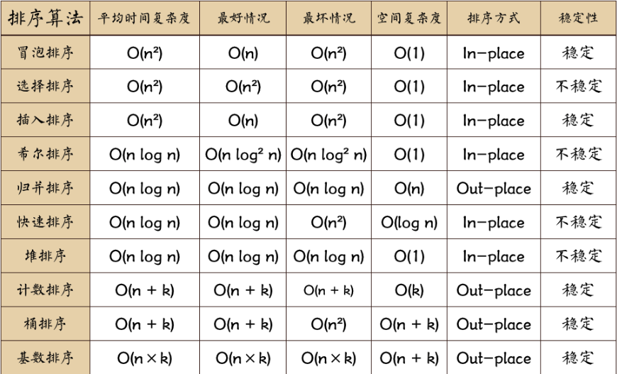

> 算法描述大部分来自https://github.com/francistao/LearningNotes/blob/master/Part3/Algorithm/Sort/%E9%9D%A2%E8%AF%95%E4%B8%AD%E7%9A%84%2010%20%E5%A4%A7%E6%8E%92%E5%BA%8F%E7%AE%97%E6%B3%95%E6%80%BB%E7%BB%93.md

> 算法实现JavaScript版来自https://github.com/damonare/Sorts

先放一张图

**图片名词解释：** n: 数据规模 k:“桶”的个数 In-place: 占用常数内存，不占用额外内存 Out-place: 占用额外内存



排序分类:


## 冒泡排序

不浪费时间了了,这人人都会.

```JavaScript
function bubbleSort(arr) {
    var len = arr.length;
    for (var i = 0; i < len; i++) {
        for (var j = 0; j < len - 1 - i; j++) {
            if (arr[j] > arr[j+1]) {        //相邻元素两两对比
                var temp = arr[j+1];        //元素交换
                arr[j+1] = arr[j];
                arr[j] = temp;
            }
        }
    }
    return arr;
}
var arr=[3,44,38,5,47,15,36,26,27,2,46,4,19,50,48];
console.log(bubbleSort(arr));//[2, 3, 4, 5, 15, 19, 26, 27, 36, 38, 44, 46, 47, 48, 50]
```


```JavaScript
//改进版
function bubbleSort2(arr) {
    console.time('改进后冒泡排序耗时');
    var i = arr.length-1;  //初始时,最后位置保持不变
    while ( i> 0) {
        var pos= 0; //每趟开始时,无记录交换
        for (var j= 0; j< i; j++)
            if (arr[j]> arr[j+1]) {
                pos= j; //记录交换的位置
                var tmp = arr[j]; arr[j]=arr[j+1];arr[j+1]=tmp;
            }
        i= pos; //为下一趟排序作准备
     }
     console.timeEnd('改进后冒泡排序耗时');
     return arr;
}
var arr=[3,44,38,5,47,15,36,26,27,2,46,4,19,50,48];
console.log(bubbleSort2(arr));//[2, 3, 4, 5, 15, 19, 26, 27, 36, 38, 44, 46, 47, 48, 50]
```


## 选择排序

选择排序的思想其实和冒泡排序有点类似，都是在一次排序后把最小的元素放到最前面。但是过程不同，冒泡排序是通过相邻的比较和交换。而选择排序是通过对整体的选择。举个栗子，对5,3,8,6,4这个无序序列进行简单选择排序，首先要选择5以外的最小数来和5交换，也就是选择3和5交换，一次排序后就变成了3,5,8,6,4.对剩下的序列一次进行选择和交换，最终就会得到一个有序序列。其实选择排序可以看成冒泡排序的优化，因为其目的相同，只是选择排序只有在确定了最小数的前提下才进行交换，大大减少了交换的次数。选择排序的时间复杂度为O(n^2).

```JavaScript
function selectionSort(arr) {
    var len = arr.length;
    var minIndex, temp;
    console.time('选择排序耗时');
    for (var i = 0; i < len - 1; i++) {
        minIndex = i;
        for (var j = i + 1; j < len; j++) {
            if (arr[j] < arr[minIndex]) {     //寻找最小的数
                minIndex = j;                 //将最小数的索引保存
            }
        }
        temp = arr[i];
        arr[i] = arr[minIndex];
        arr[minIndex] = temp;
    }
    console.timeEnd('选择排序耗时');
    return arr;
}
var arr=[3,44,38,5,47,15,36,26,27,2,46,4,19,50,48];
console.log(selectionSort(arr));//[2, 3, 4, 5, 15, 19, 26, 27, 36, 38, 44, 46, 47, 48, 50]
```


## 插入排序

插入排序不是通过交换位置而是通过比较找到合适的位置插入元素来达到排序的目的的。相信大家都有过打扑克牌的经历，特别是牌数较大的。在分牌时可能要整理自己的牌，牌多的时候怎么整理呢？就是拿到一张牌，找到一个合适的位置插入。这个原理其实和插入排序是一样的。举个栗子，对5,3,8,6,4这个无序序列进行简单插入排序，首先假设第一个数的位置时正确的，想一下在拿到第一张牌的时候，没必要整理。然后3要插到5前面，把5后移一位，变成3,5,8,6,4.想一下整理牌的时候应该也是这样吧。然后8不用动，6插在8前面，8后移一位，4插在5前面，从5开始都向后移一位。注意在插入一个数的时候要保证这个数前面的数已经有序。简单插入排序的时间复杂度也是O(n^2)。

ps:这个就跟打扑克的时候整牌的流程差不多

```JavaScript
function insertionSort(array) {
    if (Object.prototype.toString.call(array).slice(8, -1) === 'Array') {
        console.time('插入排序耗时：');
        for (var i = 1; i < array.length; i++) {
            var key = array[i];
            var j = i - 1;
            while (j >= 0 && array[j] > key) {
                array[j + 1] = array[j];
                j--;
            }
            array[j + 1] = key;
        }
        console.timeEnd('插入排序耗时：');
        return array;
    } else {
        return 'array is not an Array!';
    }
}
```

## 希尔排序

希尔排序是插入排序的一种高效率的实现，也叫缩小增量排序。简单的插入排序中，如果待排序列是正序时，时间复杂度是O(n)，如果序列是基本有序的，使用直接插入排序效率就非常高。希尔排序就利用了这个特点。基本思想是：先将整个待排记录序列分割成为若干子序列分别进行直接插入排序，待整个序列中的记录基本有序时再对全体记录进行一次直接插入排序。 

希尔排序的特点是，子序列的构成不是简单的逐段分割，而是将某个相隔某个增量的记录组成一个子序列。如上面的例子，第一堂排序时的增量为5，第二趟排序的增量为3。由于前两趟的插入排序中记录的关键字是和同一子序列中的前一个记录的关键字进行比较，因此关键字较小的记录就不是一步一步地向前挪动，而是跳跃式地往前移，从而使得进行最后一趟排序时，整个序列已经做到基本有序，只要作记录的少量比较和移动即可。因此希尔排序的效率要比直接插入排序高。希尔排序的分析是复杂的，时间复杂度是所取增量的函数，这涉及一些数学上的难题。但是在大量实验的基础上推出当n在某个范围内时，时间复杂度可以达到O(n^1.3)。

**希尔排序图示（图片来源网络）：**

[](https://camo.githubusercontent.com/566f29b741c91b49352e1d98150e109f6ae500ce/687474703a2f2f696d672e626c6f672e6373646e2e6e65742f3230313630393136323335323033343137)

## 快速排序

快速排序一听名字就觉得很高端，在实际应用当中快速排序确实也是表现最好的排序算法。快速排序虽然高端，但其实其思想是来自冒泡排序，冒泡排序是通过相邻元素的比较和交换把最小的冒泡到最顶端，而快速排序是比较和交换小数和大数，这样一来不仅把小数冒泡到上面同时也把大数沉到下面。举个栗子：对5,3,8,6,4这个无序序列进行快速排序，思路是右指针找比基准数小的，左指针找比基准数大的，交换之。5,3,8,6,4 用5作为比较的基准，最终会把5小的移动到5的左边，比5大的移动到5的右边。5,3,8,6,4 首先设置i,j两个指针分别指向两端，j指针先扫描（思考一下为什么？）4比5小停止。然后i扫描，8比5大停止。交换i,j位置。5,3,4,6,8 然后j指针再扫描，这时j扫描4时两指针相遇。停止。然后交换4和基准数。4,3,5,6,8 一次划分后达到了左边比5小，右边比5大的目的。之后对左右子序列递归排序，最终得到有序序列。上面留下来了一个问题为什么一定要j指针先动呢？首先这也不是绝对的，这取决于基准数的位置，因为在最后两个指针相遇的时候，要交换基准数到相遇的位置。一般选取第一个数作为基准数，那么就是在左边，所以最后相遇的数要和基准数交换，那么相遇的数一定要比基准数小。所以j指针先移动才能先找到比基准数小的数。快速排序是不稳定的，其时间平均时间复杂度是O(nlgn)。 

## 堆排序

堆排序是借助堆来实现的选择排序，思想同简单的选择排序，以下以大顶堆为例。注意：如果想升序排序就使用大顶堆，反之使用小顶堆。原因是堆顶元素需要交换到序列尾部。首先，实现堆排序需要解决两个问题：1. 如何由一个无序序列键成一个堆？2. 如何在输出堆顶元素之后，调整剩余元素成为一个新的堆？第一个问题，可以直接使用线性数组来表示一个堆，由初始的无序序列建成一个堆就需要自底向上从第一个非叶元素开始挨个调整成一个堆。第二个问题，怎么调整成堆？首先是将堆顶元素和最后一个元素交换。然后比较当前堆顶元素的左右孩子节点，因为除了当前的堆顶元素，左右孩子堆均满足条件，这时需要选择当前堆顶元素与左右孩子节点的较大者（大顶堆）交换，直至叶子节点。我们称这个自堆顶自叶子的调整成为筛选。从一个无序序列建堆的过程就是一个反复筛选的过程。若将此序列看成是一个完全二叉树，则最后一个非终端节点是n/2取底个元素，由此筛选即可。举个栗子：49,38,65,97,76,13,27,49序列的堆排序建初始堆和调整的过程如下：

## 归并排序

```java
package sortdemo;

import java.util.Arrays;

/**
 * Created by chengxiao on 2016/12/8.
 */
public class MergeSort {
    public static void main(String []args){
        int []arr = {9,8,7,6,5,4,3,2,1};
        sort(arr);
        System.out.println(Arrays.toString(arr));
    }
    public static void sort(int []arr){
        int []temp = new int[arr.length];//在排序前，先建好一个长度等于原数组长度的临时数组，避免递归中频繁开辟空间
        sort(arr,0,arr.length-1,temp);
    }
    private static void sort(int[] arr,int left,int right,int []temp){
        if(left<right){
            int mid = (left+right)/2;
            sort(arr,left,mid,temp);//左边归并排序，使得左子序列有序
            sort(arr,mid+1,right,temp);//右边归并排序，使得右子序列有序
            merge(arr,left,mid,right,temp);//将两个有序子数组合并操作
        }
    }
    private static void merge(int[] arr,int left,int mid,int right,int[] temp){
        int i = left;//左序列指针
        int j = mid+1;//右序列指针
        int t = 0;//临时数组指针
        while (i<=mid && j<=right){
            if(arr[i]<=arr[j]){
                temp[t++] = arr[i++];
            }else {
                temp[t++] = arr[j++];
            }
        }
        while(i<=mid){//将左边剩余元素填充进temp中
            temp[t++] = arr[i++];
        }
        while(j<=right){//将右序列剩余元素填充进temp中
            temp[t++] = arr[j++];
        }
        t = 0;
        //将temp中的元素全部拷贝到原数组中
        while(left <= right){
            arr[left++] = temp[t++];
        }
    }
}
```
归并排序是另一种不同的排序方法，因为归并排序使用了递归分治的思想，所以理解起来比较容易。其基本思想是，先递归划分子问题，然后合并结果。把待排序列看成由两个有序的子序列，然后合并两个子序列，然后把子序列看成由两个有序序列。。。。。倒着来看，其实就是先两两合并，然后四四合并。。。最终形成有序序列。空间复杂度为O(n)，时间复杂度为O(nlogn)。


## 计数排序

如果在面试中有面试官要求你写一个O(n)时间复杂度的排序算法，你千万不要立刻说：这不可能！虽然前面基于比较的排序的下限是O(nlogn)。但是确实也有线性时间复杂度的排序，只不过有前提条件，就是待排序的数要满足一定的范围的整数，而且计数排序需要比较多的辅助空间。其基本思想是，用待排序的数作为计数数组的下标，统计每个数字的个数。然后依次输出即可得到有序序列。 

## 桶排序

桶排序算是计数排序的一种改进和推广，但是网上有许多资料把计数排序和桶排序混为一谈。其实桶排序要比计数排序复杂许多。对桶排序的分析和解释借鉴这位兄弟的文章（有改动）：http://hxraid.iteye.com/blog/647759

桶排序的基本思想：

假设有一组长度为N的待排关键字序列K[1....n]。首先将这个序列划分成M个的子区间(桶) 。然后基于某种映射函数 ，将待排序列的关键字k映射到第i个桶中(即桶数组B的下标 i) ，那么该关键字k就作为B[i]中的元素(每个桶B[i]都是一组大小为N/M的序列)。接着对每个桶B[i]中的所有元素进行比较排序(可以使用快排)。然后依次枚举输出B[0]….B[M]中的全部内容即是一个有序序列。bindex=f(key) 其中，bindex 为桶数组B的下标(即第bindex个桶), k为待排序列的关键字。桶排序之所以能够高效，其关键在于这个映射函数，它必须做到：如果关键字k1<k2，那么f(k1)<=f(k2)。也就是说B(i)中的最小数据都要大于B(i-1)中最大数据。很显然，映射函数的确定与数据本身的特点有很大的关系。 

举个栗子：


假如待排序列K= {49、 38 、 35、 97 、 76、 73 、 27、 49 }。这些数据全部在1—100之间。因此我们定制10个桶，然后确定映射函数f(k)=k/10。则第一个关键字49将定位到第4个桶中(49/10=4)。依次将所有关键字全部堆入桶中，并在每个非空的桶中进行快速排序后得到如图所示。只要顺序输出每个B[i]中的数据就可以得到有序序列了。

桶排序分析：

桶排序利用函数的映射关系，减少了几乎所有的比较工作。实际上，桶排序的f(k)值的计算，其作用就相当于快排中划分，希尔排序中的子序列，归并排序中的子问题，已经把大量数据分割成了基本有序的数据块(桶)。然后只需要对桶中的少量数据做先进的比较排序即可。

对N个关键字进行桶排序的时间复杂度分为两个部分：

(1) 循环计算每个关键字的桶映射函数，这个时间复杂度是O(N)。

(2) 利用先进的比较排序算法对每个桶内的所有数据进行排序，其时间复杂度为 ∑ O(Ni\*logNi) 。其中Ni 为第i个桶的数据量。

很显然，第(2)部分是桶排序性能好坏的决定因素。尽量减少桶内数据的数量是提高效率的唯一办法(因为基于比较排序的最好平均时间复杂度只能达到O(N*logN)了)。因此，我们需要尽量做到下面两点：

(1) 映射函数f(k)能够将N个数据平均的分配到M个桶中，这样每个桶就有[N/M]个数据量。

(2) 尽量的增大桶的数量。极限情况下每个桶只能得到一个数据，这样就完全避开了桶内数据的“比较”排序操作。当然，做到这一点很不容易，数据量巨大的情况下，f(k)函数会使得桶集合的数量巨大，空间浪费严重。这就是一个时间代价和空间代价的权衡问题了。

对于N个待排数据，M个桶，平均每个桶[N/M]个数据的桶排序平均时间复杂度为：O(N)+O(M*(N/M)*log(N/M))=O(N+N*(logN-logM))=O(N+N*logN-N*logM)当N=M时，即极限情况下每个桶只有一个数据时。桶排序的最好效率能够达到O(N)。

总结： 桶排序的平均时间复杂度为线性的O(N+C)，其中C=N*(logN-logM)。如果相对于同样的N，桶数量M越大，其效率越高，最好的时间复杂度达到O(N)。 当然桶排序的空间复杂度 为O(N+M)，如果输入数据非常庞大，而桶的数量也非常多，则空间代价无疑是昂贵的。此外，桶排序是稳定的。 

## 基数排序

基数排序又是一种和前面排序方式不同的排序方式，基数排序不需要进行记录关键字之间的比较。基数排序是一种借助多关键字排序思想对单逻辑关键字进行排序的方法。所谓的多关键字排序就是有多个优先级不同的关键字。比如说成绩的排序，如果两个人总分相同，则语文高的排在前面，语文成绩也相同则数学高的排在前面。。。如果对数字进行排序，那么个位、十位、百位就是不同优先级的关键字，如果要进行升序排序，那么个位、十位、百位优先级一次增加。基数排序是通过多次的收分配和收集来实现的，关键字优先级低的先进行分配和收集。

举个栗子：