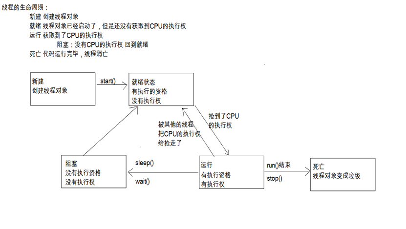

# java多线程

## 1. 多线程概述

### 进程：

正在运行的程序，是系统进行资源分配和调用的独立单位。
每一个进程都有它自己的内存空间和系统资源。

多进程的意义:提高了CPU利用率

### 线程：

线程是依赖于进程存在的,是进程中的单个顺序控制流，是一条执行路径
一个进程如果只有一条执行路径，则称为单线程程序。
一个进程如果有多条执行路径，则称为多线程程序。

多线程的意义:提高了应用程序的使用率

> 并行和并发。
>
> - 前者是逻辑上同时发生，指在某一个时间内同时运行多个程序。
>   - 后者是物理上同时发生，指在某一个时间点同时运行多个程序。

## 2. 多线程实现方案

我们知道创建新执行线程有两种方法。

- 方式1：继承Thread类
- 方式2：实现Runnable接口

### 实现方案1

继承Thread类的步骤：

- A:自定义类MyThread继承自Thread类
- B:重写run()方法
- C:创建子类对象
- D:启动线程

几个常见的小问题：

- A:为什么要重写run()方法?

  因为run()方法封装的代码才是被线程执行的代码。

- B:启动线程使用的是那个方法?

  start():启动线程，并自动调用run()方法。

- C:start()和run()的区别?
  start:启动线程，并自动调用run()方法
  run:直接调用，仅仅是普通方法的调用

- D:线程能不能多次启动?
  不能

```java
//MyThread.java
public class MyThread extends Thread {
	@Override
    //https://blog.csdn.net/zht666/article/details/7869383
	public void run() {
		// System.out.println("hello");
		// 要被线程执行的代码，一般来说应该是比较耗时的
		for (int x = 0; x < 100; x++) {
			System.out.println("hello" + x);
		}
	}
}

//MyThreadDemo.java
public class MyThreadDemo {
	public static void main(String[] args) {
		// 创建子类对象
		// MyThread mt = new MyThread();
		// mt.run();
		// mt.run();

		// MyThread mt1 = new MyThread();
		// MyThread mt2 = new MyThread();
		// mt1.run();
		// mt2.run();

		MyThread mt1 = new MyThread();
		MyThread mt2 = new MyThread();
		mt1.start();
		mt2.start();

		// IllegalThreadStateException
		// mt1.start();
	}
}
//https://www.cnblogs.com/dolphin0520/p/3920357.html
```

### 实现方案2

实现Runnable接口相比继承Thread类有如下优势：

​    1、可以避免由于Java的单继承特性而带来的局限；

​    2、增强程序的健壮性，代码能够被多个线程共享，代码与数据是独立的；

​    3、适合多个相同程序代码的线程区处理同一资源的情况。

```java
class MyThread implements Runnable{
	private int ticket = 5;
	public void run(){
		for (int i=0;i<10;i++)
		{
			if(ticket > 0){
				System.out.println("ticket = " + ticket--);
			}
		}
	}
}
 
public class RunnableDemo{
	public static void main(String[] args){
		MyThread my = new MyThread();
		new Thread(my).start();
		new Thread(my).start();
		new Thread(my).start();
	}
}
```


## 3. 线程调度和线程控制

### 线程调度

假如我们的计算机只有一个 CPU，那么 CPU 在某一个时刻只能执行一条指令，线程只有得到 CPU时间片，也就是使用权，才可以执行指令。那么Java是如何对线程进行调用的呢？

线程有两种调度模型：

- 分时调度模型   所有线程轮流使用 CPU 的使用权，平均分配每个线程占用 CPU 的时间片
- 抢占式调度模型   优先让优先级高的线程使用 CPU，如果线程的优先级相同，那么会随机选择一个，优先级高的线程获取的 CPU 时间片相对多一些。 
- Java使用的是抢占式调度模型。
- 演示如何设置和获取线程优先级
  - `public final int getPriority()`
  - `public final void setPriority(int newPriority)`

### 线程控制

我们已经知道了线程的调度，接下来我们就可以使用如下方法对象线程进行控制

- 线程休眠

  `public static void sleep(long millis)`

- 线程加入

  `public final void join()`

- 线程礼让

  `public static void yield()`

- 守护线程

  `public final void setDaemon(boolean on)`

- 中断线程

  `public final void stop()`

  `public void interrupt()`


## 4. 线程生命周期



## 5. 线程同步

同步的前提

- 多个线程
- 多个线程使用的是同一个锁对象

同步的好处

- 同步的出现解决了多线程的安全问题。

同步的弊端

- 当线程相当多时，因为每个线程都会去判断同步上的锁，这是很耗费资源的，无形中会降低程序的运行效率。

## 6. 死锁

同步弊端

- 效率低
- 如果出现了同步嵌套，就容易产生死锁问题

死锁问题及其代码

- 是指两个或者两个以上的线程在执行的过程中，因争夺资源产生的一种互相等待现象
- 同步代码块的嵌套案例

## 7. 线程间通信

针对同一个资源的操作有不同种类的线程

举例：卖票有进的，也有出的。

通过设置线程(生产者)和获取线程(消费者)针对同一个学生对象进行操作

## 8. 定时器的使用

定时器是一个应用十分广泛的线程工具，可用于调度多个定时任务以后台线程的方式执行。在Java中，可以通过Timer和TimerTask类来实现定义调度的功能

## 9. Java程序运行原理

java 命令会启动 java 虚拟机，启动 JVM，等于启动了一个应用程序，也就是启动了一个进程。该进程会自动启动一个 “主线程” ，然后主线程去调用某个类的 main 方法。所以 main方法运行在主线程中。在此之前的所有程序都是单线程的。

> 思考：
>
> jvm虚拟机的启动是单线程的还是多线程的？
>
> 
>
> 答案：多线程的。  
>
> 原因是垃圾回收线程也要先启动,否则很容易会出现内存溢出。  
>
> 现在的垃圾回收线程加上前面的主线程,最少启动了两个线程,所以,jvm的启动是多线程的