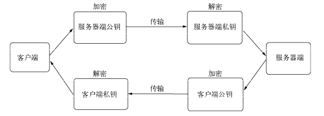
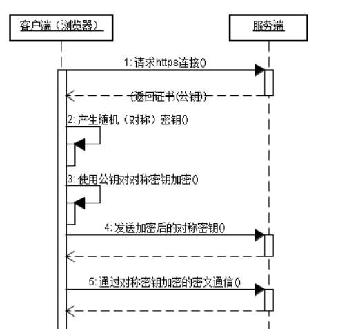
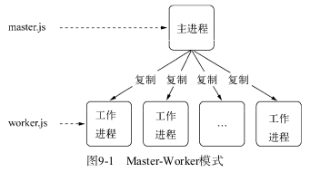
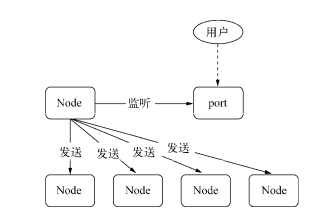
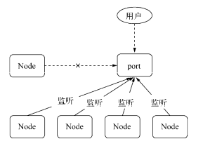

# Node.js 是一个基于 [Chrome V8](https://v8.dev/) 引擎 的 JavaScript 运行时。
## Node.js 核心概念

[阻塞对比非阻塞一览](https://nodejs.org/zh-cn/docs/guides/blocking-vs-non-blocking/)

[Node.js 事件轮询，定时器 和 process.nextTick()](https://nodejs.org/zh-cn/docs/guides/event-loop-timers-and-nexttick/)

[不要阻塞你的事件轮询（或是工作池）](https://nodejs.org/zh-cn/docs/guides/dont-block-the-event-loop/)

[Node.js 中的定时器](https://nodejs.org/zh-cn/docs/guides/timers-in-node/)

要理解事件循环, 首先明白微任务和宏任务有哪些

宏任务主要包含：script(整体代码)、setTimeout、setInterval、I/O、UI交互事件、setImmediate(Node.js 环境)

微任务主要包含：Promise、MutaionObserver、process.nextTick(Node.js 环境)

补充一个闭包的作用:
> 不要让复杂的计算阻塞事件循环
>
>假设你想在 JavaScript 处理一个复杂的计算，而又不想阻塞事件循环。 你有两种选择：任务拆分或任务分流。
>
> 任务拆分
>
>你可以把你的复杂计算 拆分开，然后让每个计算分别运行在事件循环中，不过你要定期地让其它一些等待的事件执行就会。 在 JavaScript 中，用闭包很容易实现保存执行的上下文.

Node 有两种类型的线程：一个事件循环线程和 k 个工作线程。 事件循环负责 JavaScript 回调和非阻塞 I/O，工作线程执行与 C++ 代码对应的、完成异步请求的任务，包括阻塞 I/O 和 CPU 密集型工作。 这两种类型的线程一次都只能处理一个活动。 如果任意一个回调或任务需要很长时间，则运行它的线程将被 阻塞。 如果你的应用程序发起阻塞的回调或任务，在好的情况下这可能只会导致吞吐量下降（客户端/秒），而在最坏情况下可能会导致完全拒绝服务。

要编写高吞吐量、防 DoS 攻击的 web 服务，您必须确保不管在良性或恶意输入的情况下，您的事件循环线程和您的工作线程都不会阻塞。

事件循环, 观察者, 请求对象, I/O线程池 这四者共同构成了 Node 异步 I/O 模型的基本要素.

```
   ┌───────────────────────────┐
┌─>│           timers          │
│  └─────────────┬─────────────┘
│  ┌─────────────┴─────────────┐
│  │     pending callbacks     │
│  └─────────────┬─────────────┘
│  ┌─────────────┴─────────────┐
│  │       idle, prepare       │
│  └─────────────┬─────────────┘      ┌───────────────┐
│  ┌─────────────┴─────────────┐      │   incoming:   │
│  │           poll            │<─────┤  connections, │
│  └─────────────┬─────────────┘      │   data, etc.  │
│  ┌─────────────┴─────────────┐      └───────────────┘
│  │           check           │
│  └─────────────┬─────────────┘
│  ┌─────────────┴─────────────┐
└──┤      close callbacks      │
   └───────────────────────────┘
```

事件驱动的本质: 通过主循环加事件触发的方式来运行程序.

定时器*：本阶段执行已经安排的 setTimeout() 和 setInterval() 的回调函数。

    setTimeout() 会采用红黑树来存储定时器
*待定回调*：执行延迟到下一个循环迭代的 I/O 回调。

*idle, prepare*：仅系统内部使用。

*轮询*：检索新的 I/O 事件;执行与 I/O 相关的回调（几乎所有情况下，除了关闭的回调函数，它们由计时器和 setImmediate() 排定的之外），其余情况 node 将在此处阻塞。

*检测*：setImmediate() 回调函数在这里执行。

*关闭的回调函数*：一些准备关闭的回调函数，如：socket.on('close', ...)。
在每次运行的事件循环之间，Node.js 检查它是否在等待任何异步 I/O 或计时器，如果没有的话，则关闭干净。

*process.nextTick()*: 在技术上不是事件循环的一部分。相反，无论事件循环的当前阶段如何，都将在当前操作完成后处理 nextTickQueue。

    `process.nextTick()` 的优先级高于 `setImmediate()` , `process.nextTick()` 的回调函数放在一个数组中,并且在每轮循环中会将数组中的回调函数全部执行完, `setImmediate()` 的结果放在链表里,在每轮循环中只会执行一个回调.

## 内存控制
### V8的内存限制
```node
$ node
> process.memoryUsage();
{ rss: 33443840, // resident set size 进程的常驻内存部分
  heapTotal: 9682944,
  heapUsed: 5330856,
  external: 9223
}
```
### V8的垃圾回收机制与内存限制
1. V8 的垃圾回收策略主要基于分代式垃圾回收机制
   
   现代的垃圾回收算法中按对象的存活时间将内存的垃圾回收进行不同的分代,然后分别对不同分代的内存使用更高效的算法

   _V8 的内存分代_

   在 V8 中,主要将内存分为新生代和老生代两代. 新生代中的对象为存活时间较短的对象.老生代中的对象为存活时间较长或常驻内存的对象.新生代 + 老生代的内存空间 = heapTotal

   _Scavenge算法_

   在分代的基础上, 新生代中的对象主要通过 Scavenge 算法进行垃圾回收, Scavenge 算法的具体实现主要采用了 Cheney 算法.

   _Mark-Sweep (标记-清除) & Mark-Compact (标记-整理)_
   
   Mark-Sweep 可能会造成内存空间不连续的状况.Mark-Compact 可以将不连续的空间整理到一块连续的空间.

   V8主要使用前者, 因为速度更快.

   _Incremental Marking(增量标记)_

2. 查看垃圾回收日志

    `--trace_gc // 打印垃圾回收的日志信息`
    `-prof // 得到 V8 执行时的性能分析数据`

### 高效使用内存
主动释放变量可以使用 `delete` , 但是在 V8 重新赋值比价好,因为在 V8 中通过 `delete` 删除对象的属性有可能干扰 V8 的优化.

在正常的 JavaScript 执行中, 无法立即回收的内存有闭包和全局变量引用这两种情况.

### 内存指标
os 模块中的 `` 和 `` 这两个方法用于查看操作系统的内存使用情况, 它们分别返回系统的总内存和闲置内存,以字节为单位.

`rss > heapTotal` 由此可见 Node 中的内存使用并非都是通过 V8 进行分配的. 我们将那些不是通过 V8 分配的内存成为堆外内存.

### 内存泄露

通常, 造成内存泄漏的原因有如下几个:
- 缓存
- 队列消费不及时
- 作用域未释放

#### 慎将内存当做缓存
缓存策略限制
- [LRU](https://baike.baidu.com/item/LRU)

缓存的解决方案
- 采用进程外的缓存

#### 关注队列状态

### 内存泄露排查
`node-heapdump` 和 `node-memwatch`

### 大内存应用
使用 stream 和 pipe 来实现大文件传输.

## Buffer
在引入 [TypedArray](https://developer.mozilla.org/zh-CN/docs/Web/JavaScript/Reference/Global_Objects/TypedArray) 之前，JavaScript 语言没有用于读取或操作二进制数据流的机制。 Buffer 类是作为 Node.js API 的一部分引入的，用于在 TCP 流、文件系统操作、以及其他上下文中与八位字节流进行交互。

现在可以使用 TypedArray， Buffer 类以更优化和更适合 Node.js 的方式实现了 Uint8Array API。

Buffer 是一个像 Array 的对象,主要用于操作字节.

### Buffer 结构
Buffer 类的实例类似于整数数组，但对应于 V8 堆外部的固定大小的原始内存分配。 Buffer 的大小在创建时确定，且无法更改。

Buffer 的元素为16进制的两位数, 即0到255的数值, Buffer 是二进制数据.

```js
var buf = new Buffer('床前明月光, 疑是地上霜; 举头望明月, 低头思故乡.', 'utf-8');
console.log(buf);
console.log(buf.length);
```

> 在Node 6.0以前，直接使用new Buffer，但是这种方式存在两个问题:
>
> - 参数复杂: 内存分配，还是内存分配+内容写入，需要根据参数来确定
> - 安全隐患: 分配到的内存可能还存储着旧数据，这样就存在安全隐患

```js
new Buffer(number)            // Old
Buffer.alloc(number)          // New

new Buffer(string)            // Old
Buffer.from(string)           // New

new Buffer(string, encoding)  // Old
Buffer.from(string, encoding) // New

new Buffer(...arguments)      // Old
Buffer.from(...arguments)     // New
```

Buffer 对象的内存分配不是在 V8 的堆内存中,而是在 Node 的 C++ 层面实现内存的申请的. 

为了高效的使用申请来的内存, Node 采用了 [slab](https://zhuanlan.zhihu.com/p/36140017) 分配机制

### Buffer 的转换
可以用 `Buffer.isEncoding(encoding)` 来判断编码是否支持转换
### Buffer 的拼接
#### setEncoding() 和 string_decoder()
`data += chunk` 等价于 `data = data.toString() + chunk.toString()`

这段代码在英文环境下没有问题, 但是中文会出现乱码. 因为一个中文字符在  UTF-8 下占三个元素.

可以添用 `readable.setEncoding(encoding)` 来设置编码的方法, 该方法的作用是让data事件传递的不再是一个 Buffer 对象, 而是编码侯的字符串.

isEncoding 依赖 decoder 进行解码, decoder 对象来自于 string_decoder 模块 StringDecoder 的实例对象.

这种办法只能处理部分编码, 所以不能从根本上解决问题.
#### 正确拼接 Buffer
下面是 Node 10.15.3 中 Buffer.concat() 的源码.
```js
function concat(list, length) {
  // list 是要合并的多个 Buffer
  var i;
  if (!Array.isArray(list)) {
    throw new ERR_INVALID_ARG_TYPE(`\'list\', [\'Array\', \'Buffer\', \'Uint8Array\'], list`);
  }
  if (list.length === 0)
    return new FastBuffer();
  if (length === undefined) {
    length = 0;
    for (i = 0; i < list.length; i++)
      length += list[i].length;
  } else {
    // 右移零位的作用是去掉小数位
    length = length >>> 0;
  }
  var buffer = Buffer.allocUnsafe(length);
  var pos = 0;
  for (i = 0; i < list.length; i++) {
    var buf = list[i]; 
    if (!isUint8Array(buf)) {
      // TODO(BridgeAR): This should not be of type ERR_INVALID_ARG_TYPE.    
      // Instead, find the proper error code for this.    
      throw new ERR_INVALID_ARG_TYPE(``list[${i}]`, [\'Array\', \'Buffer\', \'Uint8Array\'], list[i]`);
    }
    _copy(buf, buffer, pos);
    pos += buf.length;
  }
  // Note: `length` is always equal to `buffer.length` at this point  
  if (pos < length) {
    // Zero-fill the remaining bytes if the specified `length` was more than   
    // the actual total length, i.e. if we have some remaining allocated bytes   
    // there were not initialized.  
    buffer.fill(0, pos, length);
  }
  return buffer;
}
```
### Buffer 与性能
使用 Buffer 比使用 string 性能有很大提升

读取一个大文件时, `highWaterMark` 越大, 读取速度越快.

## [event](http://nodejs.cn/api/events.html) 事件触发器

> 大多数 Node.js 核心 API 构建于惯用的异步事件驱动架构，其中某些类型的对象（又称触发器，Emitter）会触发命名事件来调用函数（又称监听器，Listener）。
> 
> 例如，net.Server 会在每次有新连接时触发事件，fs.ReadStream 会在打开文件时触发事件，stream会在数据可读时触发事件。
> 
> 所有能触发事件的对象都是 EventEmitter 类的实例。 这些对象有一个 eventEmitter.on() 函数，用于将一个或多个函数绑定到命名事件上。 事件的命名通常是驼峰式的字符串。
> 
> 当 EventEmitter 对象触发一个事件时，所有绑定在该事件上的函数都会被同步地调用。
> 
> 例子，一个简单的 EventEmitter 实例，绑定了一个监听器。 eventEmitter.on() 用于注册监听器， eventEmitter.emit() 用于触发事件。
```js
const EventEmitter = require('events');

class MyEmitter extends EventEmitter {}

const myEmitter = new MyEmitter();
myEmitter.on('event', () => {
  console.log('触发事件');
});
myEmitter.emit('event');
```
## 网络编程
### Websocket
WebSocket 客户端基于事件的编程模型和 Node 中自定义事件相差无几

WebSocket 实现了客户端和服务器端的长连接, 而 Node 事件驱动的方式十分擅长与大量的客户端保持高并发连接.

Websocket 与传统 HTTP 相比的好处:
- 客户端和服务器端只建立一个 TCP 连接
- 支持服务器端推送
- 有更轻量级的协议头, 减少数据传送量

### 网络服务与安全
TLS/SSL 实现过程



在建立安全连接之前, 客户端和服务器端之间需要互换公钥

对称加密虽好. 但是网络中依然可能存在窃听的情况. 客户端和服务器端在交换公钥的过程中. 典型的例子是中问人攻击客户端的角色. 中间人对客户端扮演服务器端的角色. 对服务器端扮演因此客户端和服务器端几乎感受不到中间人的存在. 为了解决这种问题, 数据输过程中还需要对得到的公钥进行认证. 以确认得到的公钥是出自目标服务器. 

为了解决这个问题, 引入了数字证书.

一次完整的 HTTPS 连接如下图



思路就是使用非对称个加密来传送之后要使用的对称加密的秘钥.

## 构建 Web 应用
### 基础功能
- [RESTful API](https://www.zhihu.com/question/28557115)

- 路径解析多用于静态文件服务器,还有一种比较常见的分发场景是根据路径来选择控制器, 它预设路径为控制器和行为的组合, 无需配置额外的路由信息.
- 查询字符串
- Cookie `req.headers.cookie`

    Cookie: 由后端给出 `Set-Cookie: name=value; Path=/; Expires=xxx; Domain=.domain.com`

    path: 表示这个Cookie影响到的路径

    HttpOnly: 告知浏览器不允许通过 document.cookie 去修改这个 cookie 

    Secure: 当 Secure 值为 true 时, 在 HTTP 中是无效的, 在 HTTPS 中才有效

    Session: 为了解决性能问题和 Session 数据无法跨越进程共享的问题, 常用的方法是将 Session 集中化, 将原本可能分散咋多个进程里的数据, 统一转移到集中地数据存储中.

## 进程
同步 -> 复制进程 -> 多线程 -> 事件驱动
### 多进程架构



>Master-Worker模式是常用的并行模式之一，它的核心思想是，系统有两个进程协作工作：Master进程，负责接收和分配任务；Worker进程，负责处理子任务。当Worker进程将子任务处理完成后，结果返回给Master进程，由Master进程做归纳汇总，最后得到最终的结果.

Node 使用 `child_process` 模块创建子进程

> child_process.spawn() 方法异步地衍生子进程，且不阻塞 Node.js 事件循环。

> child_process.spawnSync() 方法则以同步的方式提供等效功能，但会阻止事件循环直到衍生的进程退出或终止。
>
> child_process.exec(): 衍生一个 shell 并在该 shell 中运行命令，当完成时则将 stdout 和 stderr 传给回调函数。
>
> child_process.execFile(): 类似于 child_process.exec()，除了它默认会直接衍生命令且不首先衍生 shell。
>
> child_process.fork(): 衍生一个新的 Node.js 进程，并通过建立 IPC 通信通道来调用指定的模块，该通道允许在父进程与子进程之间发送消息。
>
> child_process.execSync(): child_process.exec() 的同步版本，会阻塞 Node.js 事件循环。
>
> child_process.execFileSync(): child_process.execFile() 的同步版本，会阻塞 Node.js 事件循环。

在浏览器中主线程和工作线程( WebWorker )通过 `onmessage()` 和 `postMessage()` 进行通信.

Node 也有相对应的做法, 通过 `fork()` 或者其他 API , 创建子进程侯, 为了实现父子进程的通信, 父进程与子进程之间会创建 IPC 通道. 通过 IPC 通道, 父子进程之间才能通过 message 和 send 传递消息.

> 进程间通信
>
> IPC 的全程是 [Inter-Process Communication](https://zh.wikipedia.org/wiki/%E8%A1%8C%E7%A8%8B%E9%96%93%E9%80%9A%E8%A8%8A`)

#### 代理

一个进程只能监听一个端口, 要想实现多个进程共同监听一个端口, 通常的做法是让每个进程监听不同的端口, 主进程监听 80 端口, 主进程对外接收所有的请求, 再将这些请求分别代理到不同的端口. 这样还能实现负载均衡.

但是这种方式每收到一个连接就会用掉一个[文件描述符](https://zh.wikipedia.org/zh-cn/%E6%96%87%E4%BB%B6%E6%8F%8F%E8%BF%B0%E7%AC%A6), 因此代理方案中客户端连接到代理进程,代理进程连接到工作进程的过程需要用到两个文件描述符. 这显然是不合理的.

为了解决这个问题, Node 中进程间可以发送句柄.

发送句柄意味着什么? 在前一个问题中．我们可以去掉代理这种方案，使主进程接收到 socket 请求后，将这个 socke 直接发送给工作进程，而不是重新与工作进程之问建立新的 socket 连接来转发数据. 文件描述符浪费的问题可以通过这样的方式轻松解决.

例子

主进程代码
```js
var child = require('child_process').fork('child.js');

// Open up the server object and send the handle.
var server = require('net').createServer();
server.on('connection', function (socket) {
  socket.end('handled by parent\n');
});
server.listen(1337, function () {
  child.send('server', server);
});
```

子进程代码
```js
process.on('message', function (m, server) {
  if (m === 'server') {
    server.on('connection', function (socket) {
      socket.end('handled by child\n');
    });
  }
});
```

上面的代码, 父子进程都可能处理我们的客户端请求. 我们可以让所有请求都被子进程来处理.
```js
// parent.js
var cp = require('child_process');
var child1 = cp.fork('child.js');
var child2 = cp.fork('child.js');

// Open up the server object and send the handle.
var server = require('net').createServer();
server.listen(1337, function () {
  child1.send('server', server);
  child2.send('server', server);
  server.close();
});
```

```js
// child.js
var http = require('http');
var server = http.createServer(function (req, res) {
  res.writeHead(200, {'Content-Type': 'text/plain'});
  res.end('handled by child, pid is ' + process.pid + '\n');
});

process.on('message', function (m, tcp) {
  if (m === 'server') {
    tcp.on('connection', function (socket) {
      server.emit('connection', socket);
    });
  }
});
```
 => 

如何做到端口共同监听的?

我们独立启动的进程中. TCP 服务器端 socket 套接字的文件描述符并不相同．导致监听到相同的端口时会抛出异常.

Node 底层对每个端口监听都设置了 SO_REUSEADDR 选项，这个选项的涵义是不同进程可以就相同的网卡和端口进行监听．这个服务器端套接字可以被不同的进程复用. 但独立启动的进程互相之间并不知道文件描述符．所以监听相同端口就会失败. 但对由 send() 发送的句柄还原出来的服务而言, 它们的文件描述符是相同的．所以监听相同端口不会引起异常.

多个应用监听相同端口时，文件描述符同一时间只能被某个进程所用, 换言之就是网络请求向服务器端发送时，只有一个幸运的进程能够抢到连接．也就是说只有它能为这个请求进行服务. 这些进程服务是抢占式的

### 集群稳定
